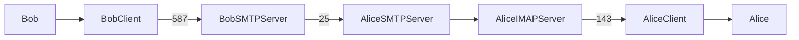

# Mail Server with Postfix and Dovecot

This post explains how to setup a [Postfix](https://www.postfix.org/) [SMTP](https://en.wikipedia.org/wiki/Simple_Mail_Transfer_Protocol) server and a [Dovecot](https://www.dovecot.org/) [IMAP](https://en.wikipedia.org/wiki/Internet_Message_Access_Protocol) server for personal use.
For enterprise I recommend selecting a trusted vendor.

This post will go through:

- the basics of email
- the configuration for Postfix
- the configuration for Dovecot and the auth
- the security (encryption)
- the DNS management: focus on being trustful (a.k.a not being seen as spam)


!!! info "**TL;DR *"I just want to copypaste the config and have a mail server now"***"

    Well, sadly there's no valid TL;DR here :(

    Setting up a mail server requires time. This is a long post that has to be tackled with patience.

    If you don't have enough time then [this](https://workspace.google.com/business/signup/welcome) is your best choice (and normally it's always the best choice)

## Requirements

You will need:

- a host with a public IP and a Debian-based distro installed, Ubuntu Focal used for this post
- a domain name pointing to this IP
- access to configure the DNS zones of that domain

## Understanding the basics
We all know the concept about sending an email and receiving it, so here we have two actions.
For both actions the "email" world has established protocols that the applications can follow.
For sending we have the [SMTP](https://en.wikipedia.org/wiki/Simple_Mail_Transfer_Protocol) protocol thanks to the [ARPANET](https://en.wikipedia.org/wiki/ARPANET) in 1983 and for receiving we have [IMAP](https://en.wikipedia.org/wiki/Internet_Message_Access_Protocol) and [POP3](https://en.wikipedia.org/wiki/Post_Office_Protocol).
For the sake of living in the present and keeping this documentation simple we can just focus on SMTP (send) and IMAP (receive).

The title of this post includes two buzzwords "Postfix" and "Dovecot", we can map them:

- Postfix -> SMTP
- Dovecot -> IMAP

So we have a Postfix to send email and a Dovecot to receive email (well, not exactly)

Let's work a bit more on the previous affirmation, and for that let's show a simple structure of clients and servers sending an email.

Imagine that Bob wants to send an email to Alice.
Bob has his own client and his own mail server, and Alice the same, something like this:

    - [Bob client]      -> speaks with -> [Bob Server]
    - [Alice client]    -> speaks with -> [Alice Server]

Imagine we have `[Bob server]` working under `@bob.com` and `[Alice Server]` under `@alice.com`.
How does an email travel from Bob to Alice?
First the client sends an email to its own SMTP server and then the SMTP server checks the `@destination.com` and sends it to the IP of that `@destination.com`, in this case `@alice.com` which identifies `[Alice Server]`.

So if Bob sends an email to `alice@alice.com` this will be the path to follow:

    [Bob client] -> [Bob Server][SMTP] -> relay -> [Alice Server][SMTP] -> [Alice client]

Here appears the buzzword `relay` which basically is the same between client->server but between SMTP Servers.

Ok, nice, and where is IMAP? Do we need it? Maybe not, maybe yes. The truth is that we need it.
Once `[Bob server][SMTP]` has relayed Bob's email to `[Alice Server][SMTP]`, `[Alice Server][SMTP]` validates the email (spam, etc) and if it's ok then the email is sent to `[Alice Server][IMAP]`.
So the whole traveling would be something like this:

1. `[Bob client]`:
    - writes an email with `alice@alice.com` as recipient
    - sends this email to `[Bob server][SMTP]`
2. `[Bob server][SMTP]`:
    - authenticates `[Bob client]` (if no auth, no email)
    - relays the email to `[Alice Server][SMTP]` (it has to find the IP based on the `@alice.com`)
3. `[Alice Server][SMTP]`:
    - validates the email coming from `[Bob server][SMTP]`
    - sends the email to `[Alice Server][IMAP]`
4. `[Alice client]`:
    - requests new email to `[Alice Server][IMAP]`
5. `[Alice Server][IMAP]`:
    - authenticates `[Alice client]` (if no auth, no email)
    - provides the email contents to `[Alice client]`
6. `[Alice client]`:
    - enjoys Bob's [content](https://youtu.be/xvFZjo5PgG0){target=_blank}

So:

    [client] -> [SMTP] -> relay -> [SMTP] -> [IMAP] -> [client]

Now we know the traveling but why we add an IMAP there? Why not just querying from the client directly to the SMTP?
Ok, that's a good one. Maybe it's because somebody decided to implement it like this with this protocol, but the concept is:

- SMTP sends and receives, but it doesn't care about storing
- IMAP does, he worries about storing

So SMTP for the traveling between mail servers and IMAP to manage all the received emails.

POP3 is like IMAP but older and with less features.

Disclaimer: All the previous summary is very rough top level without going into details, it's a bit more complicated but more or less this is the main idea.

Ok, so now we know a bit the basics and to complete this chapter it's important to mention 3 concepts and keep them in mind:

- Auth: as we live in an Internet world we need to demonstrate that we are who we are and allow using the service only to ourselves.
- DNS: the same, to demonstrate that we are who we are, but instead to ourselves, to the world.
- Encrypting: there are lots of voyeurs out there, we have to keep our content private.

These concepts will be tackled more in deep in their sections, this was just a little spoiler to be prepared. Now let's move on to the practice part.

## Setting up Postfix (v3.4.13)

What's Postfix? This is an easy one, an SMTP server.

How to install it?

!!! info inline end ""

    v3.4.13 used in this post

```bash
$ apt install postfix
```

and you can ignore all that wizard because we are going to rewrite the config.

What do we want Postfix for? We want to send an email and also to receive it, we need to `relay` and to be `relayed` so we need to configure a couple of things.

First of all, postfix has two main config files:

    /etc/postfix/main.cf
    /etc/postfix/master.cf

The `main.cf` is for the generic config and the `master.cf` is to define the services that Postfix will run.

Before going into details, first, let's copy these config files and replace all `{REPLACE_*}` in `main.cf`, the `master.cf` can be copied as it is:

For example in my case:

    myhostname = mail.{REPLACE_YOURDOMAIN}
    # replace with
    myhostname = mail.{REPLACE_YOURDOMAIN}

=== "main.cf"

    ``` c++ linenums="1" title="/etc/postfix/main.cf"
    --8<--
    posts/mailserver/postfix_main.cf
    --8<--
    ```

=== "master.cf"

    ``` c linenums="1" title="/etc/postfix/master.cf"
    --8<--
    posts/mailserver/postfix_master.cf
    --8<--
    ```

!!! info ""

    Remember to replace REPLACE_YOURDOMAIN, REPLACE_YOURDISTRO

Ok now we have a bunch of config lines that we don't know and they don't even work because they are assuming things that we have not yet configured.

Let's try to understand it first.

### Config file `main.cf`

Brief description of each parameter:

- ID:
    - [myhostname](https://www.postfix.org/postconf.5.html#myhostname): This is the [FQDN](https://en.wikipedia.org/wiki/Fully_qualified_domain_name){target=_blank} that must have an [MX DNS](https://en.wikipedia.org/wiki/MX_record){target=_blank} record pointing to this IP
    - [myorigin](https://www.postfix.org/postconf.5.html#myorigin): The contents of `/etc/mailname` should contain a valid hostname for your mail server. This is used by applications like cron, we can put the same as $myhostname in `/etc/mailname`.
    - [mydestination](https://www.postfix.org/postconf.5.html#mydestination): This parameter specifies the domains from which we will accept emails to be sent. So if you send a request from a `bob@mail.com` and `mail.com` is not in this list, `bob` will have to find another way to send his email.
- General:
    - [syslog_name](https://www.postfix.org/postconf.5.html#syslog_name): name of the logger in syslog to identify the logs. This can be overridden in each service in `master.cf`
    - [smtpd_banner](https://www.postfix.org/postconf.5.html#smtpd_banner): Message returned by the server to present himself, it's a convention and if is not respected some servers (like Gmail) can tag you as spam.
    - [append_dot_mydomain](https://www.postfix.org/postconf.5.html#append_dot_mydomain): prevents sending emails to things like "user@partialdomainname" because the `.com` won't be automatically added. We prefer to don't modify the domains.
    - [compatibility_level](https://www.postfix.org/postconf.5.html#compatibility_level): To not go into too many details, less than 2 can accept backwards compatibility but as we are installing this version from scratch we can set all the configuration parameters without backwards compatibility.
- Network
    - [mynetworks](https://www.postfix.org/postconf.5.html#mynetworks): The list of "trusted" remote SMTP clients that are allowed to relay mail through Postfix.
    - [inet_interfaces](https://www.postfix.org/postconf.5.html#inet_interfaces): The local network interface addresses that this mail system receives mail on
    - [smtp_bind_address](https://www.postfix.org/postconf.5.html#smtp_bind_address): IP used to send emails. Needed if we have multiple interfaces, and more important if they are public interfaces, because we will setup DNS records to be more trustful that will declare our public IP as the source of the server and it has to match to the IP used by Postfix, if not other SMTP servers can decide to don't trust us.
    - [inet_protocols](https://www.postfix.org/postconf.5.html#inet_protocols): The Internet protocols Postfix will attempt to use when making or accepting connections, options: ipv4, ipv6 or all which are both.
    - [smtp_address_preference](https://www.postfix.org/postconf.5.html#smtp_address_preference): Try to use this protocol before the other, if ipv4 specified Postfix will use ipv4 always as the first option.
- TLS
    - [smtpd_tls_cert_file](https://www.postfix.org/postconf.5.html#smtpd_tls_cert_file): TLS cert, we will request one from Letsencrypt with Certbot
    - [smtpd_tls_key_file](https://www.postfix.org/postconf.5.html#smtpd_tls_key_file): TLS key, we will request one from Letsencrypt with Certbot
    - [smtpd_tls_security_level](https://www.postfix.org/postconf.5.html#smtpd_tls_security_level): Specify `encrypt` for mandatory TLS encryption for the SMTP server.
    - [smtpd_tls_protocols](https://www.postfix.org/postconf.5.html#smtpd_tls_protocols): Declare the accepted protocols for TLS, we only want v1.2 or greater.
    - [smtpd_tls_loglevel](https://www.postfix.org/postconf.5.html#smtpd_tls_loglevel): Use 2 or higher to debug problems, if not, it can be with 0 as default which is disabled or 1 which is the basic.
    - [smtpd_tls_received_header](https://www.postfix.org/postconf.5.html#smtpd_tls_received_header): Add TLS details in the Received field, so when inspecting the original message received from others we can check the TLS details.
    - [smtpd_tls_auth_only](https://www.postfix.org/postconf.5.html#smtpd_tls_auth_only):  When TLS encryption is optional in the Postfix SMTP server, do not announce or accept SASL authentication over unencrypted connections.
    - [smtp_tls_note_starttls_offer](https://www.postfix.org/postconf.5.html#smtp_tls_note_starttls_offer):  Log the hostname of a remote SMTP server that offers STARTTLS, when TLS is not already enabled for that server.
    - [smtp_tls_security_level](https://www.postfix.org/postconf.5.html#smtp_tls_security_level): Use `encrypt` to force the SMTP client to use TLS.
- Auth
    - [smtpd_sasl_type](https://www.postfix.org/postconf.5.html#smtpd_sasl_type): As [SASL](https://en.wikipedia.org/wiki/Simple_Authentication_and_Security_Layer){target=_blank} type we will specify `dovecot` to use the auth system of our IMAP server.
    - [smtpd_sasl_path](https://www.postfix.org/postconf.5.html#smtpd_sasl_path): Relative path to $queue_directory used to communicate Postfix and Dovecot. This can also be configured via TCP.
    - [smtpd_sasl_auth_enable](https://www.postfix.org/postconf.5.html#smtpd_sasl_auth_enable): To enable SASL.
- Mail config
    - [mailbox_size_limit](https://www.postfix.org/postconf.5.html#mailbox_size_limit): Use 0 for unlimited mailbox size, the limit will be the host disk.
    - [recipient_delimiter](https://www.postfix.org/postconf.5.html#recipient_delimiter): Postfix allows you to specify a character to separate the user from an additional string. For example with a `+` as `recipient_delimiter` we can have the mail `user@mail.com` and also `user+extrastring@mail.com` and we will get the mails delivered to `user`. This is helpful for example when we want to check if a third party who has our address is providing our address to others, for example we provide to `randomco.com` our address `user+rco@mail.com` and later we receive an email from `spamco.com` to `user+rco@mail.com`, that is pretty clear, `randomco.com` has not being playing fair.
    - [home_mailbox](https://www.postfix.org/postconf.5.html#home_mailbox): The default dir in the home of each user which will contain all the mails.
- Milter (Mail filter)
    - [milter_macro_daemon_name](https://www.postfix.org/postconf.5.html#milter_macro_daemon_name): The name of the daemon of the [milter](https://en.wikipedia.org/wiki/Milter) that we are going to configure together with [OpenDKIM](http://www.opendkim.org/) to be more trustful.
    - [milter_default_action](https://www.postfix.org/postconf.5.html#milter_default_action): We set `accept` because we don't want to filter in Postfix, we will filter with OpenDKIM.
    - [smtpd_milters](https://www.postfix.org/postconf.5.html#smtpd_milters): The TCP port where our milter will be working, which will be the one of OpenDKIM
    - [non_smtpd_milters](https://www.postfix.org/postconf.5.html#non_smtpd_milters): The TCP port where our milter will be working, which will be the one of OpenDKIM

This is a good overview of the parameters and the meaning of each one, now let's list the ones that are not currently working because they depend on other actions:

- **myhostname, mydestination**: we need a domain name
- **smtpd_tls_cert_file, smtpd_tls_key_file**: we need TLS certificates
- **smtpd_sasl_\***: we need Dovecot
- **smtpd_milters, non_smtpd_milters**: we need OpenDKIM

We will tackle these actions in the next steps.

### Config file `master.cf`

This file contains a list of services that will be run by the `master` process as daemons, they are:

    pickup, cleanup, qmgr, tlsmgr, rewrite, bounce, defer, trace, verify, flush, proxymap, proxywrite, smtp, relay, showq, error, retry, discard, local, virtual, lmtp, anvil, scache, postlog, maildrop, uucp, ifmail, bsmtp, scalemail, mailman

What are they doing? I'm not sure, they come preconfigured in the `master.cf` as you can see and we can try to understand all of them or just focus on the two services that are relevant for our use case and leave the default ones working as Postfix expects.

The two services that we want are both running the `smtpd` command but the only difference is the port that we are going to expose.

- smtpd over port 25
- smtpd over port 587

The 25 has been the historical default SMTP port and the actual port used by SMTP servers to communicate between themselves, so when our SMTP server receives and email from an external SMTP server this communication is done using this port 25. This port accepts non encrypted communication but we are forcing to use TLS.

The port 587 is the one used by SMTP servers to receive the mail from our clients and it forces explicitly the usage of TLS.

So now understanding this, we can reuse our diagram of Alice and Bob with these services and ports:



## Dovecot (v2.3.7.2)

From the official [Dovecot site](https://www.dovecot.org/) we read this:

> Dovecot is among the best performing IMAP servers while still supporting the standard mbox and Maildir formats. The mailboxes are transparently indexed, which gives Dovecot its good performance while still providing full compatibility with existing mailbox handling tools.

The most important for us is that this will be our IMAP and also our auth backend, both Postfix and Dovecot will use Dovecot auth backend.

Let's install it

!!! info inline end ""

    v2.3.7.2 used in this post

```bash
$ apt install dovecot
```

And put these lines in `/etc/dovecot/dovecot.conf`:

``` c linenums="1" title="/etc/dovecot/dovecot.conf"
--8<--
posts/mailserver/dovecot.conf
--8<--
```

!!! info ""

    Remember to replace REPLACE_YOURDOMAIN

We need to generate the dh.pem:

!!! info inline end ""

    This will take few minutes

``` bash
$ openssl dhparam 4096 > /root/dovecot/dh.pem
```
To understand better what is DH check the [Wikipedia page](https://en.wikipedia.org/wiki/Diffie%E2%80%93Hellman_key_exchange)
&nbsp;<br>

This is enough for now, let's move to the [DNS](#dns) and [Certificates](#certificates) section which is also needed for [Postfix](#postfix)

## DNS

First of all mention that we will come back to configure DNS but we need some basics.

We need a domain name bought and somewhere to configure the DNS zones of this domain.

For example, with [Google Domains](https://domains.google/) you have the [registrar](https://domains.google.com/registrar/?pli=1&authuser=1) with basic DNS Zones management where you can manage custom records.

Depending on the domain provider and the DNS zones management provider the configuration will be one or other but the concept is the same, we will need to define a couple of records:

Imagine that our domain is `yourdomain.com` and the IP is 1.2.3.4, the records will be:

| Hostname            | Type  | Data                 |
| ------------------- | ----- |--------------------- |
| `yourdomain.com`      | A     | 1.2.3.4              |
| `mail.yourdomain.com` | A     | 1.2.3.4              |
| `yourdomain.com`      | MX    | 0 mail.yourdomain.com. |

The important part here is this, extracted from [Wikipedia MX Record page](https://en.wikipedia.org/wiki/MX_record):

> When an e-mail message is sent through the Internet, the sending mail transfer agent (MTA) queries the Domain Name System for the MX records of each recipient's domain name. This query returns a list of host names of mail exchange servers accepting incoming mail for that domain and their preferences.

So we need:

- The main A record pointing yourdomain.com to our IP
- The main A record of our mail DNS zone mail.yourdomain.com pointing to our IP too
- The main MX record of our yourdomain.com which is the one that will be after the `@` and the one used by other SMTP servers to get the mail server `mail.yourdomain.com` from this MX record. Once they have the `mail.yourdomain.com` address they can get the IP with the A record.

Now we have to wait until the public DNS servers replicate our records. We can use `dig` to validate that the public DNS that we are using from our host has these records replicated, if we don't see them it can be because it's taking long to replicate or because we did something wrong:

``` bash
$ dig +noall +answer +multiline yourdomain.com a
yourdomain.com.		57 IN A	1.2.3.4

$ dig +noall +answer +multiline mail.yourdomain.com a
mail.yourdomain.com.	1927 IN	A 1.2.3.4

$ dig +noall +answer +multiline yourdomain.com mx
yourdomain.com.		3224 IN	MX 0 mail.yourdomain.com.
```

With this we can request our certificates, let's move to [Certificates](#certificates) section.

## Certificates

The main goals of this step are:

1. Encrypt our content
2. Be more trustful

To ensure that our communication between the clients and the server and between our server and other servers is secure we need to add a layer called [TLS](https://en.wikipedia.org/wiki/Transport_Layer_Security) which encrypts our content. To encrypt the content with TLS normally we use a public key and a private key. The public key can be shared anywhere and the content encrypted with this public key can be decrypted with the private key which has to be properly custodied. This is known as asymmetric encryption.

The process that we will follow is the same that we would do to use HTTPS instead of HTTP.

We need to generate a TLS certificate and a private key and both have to be signed by a Certificate Authority. This Certificate Authority is the one that gives trustiness to our TLS certificate. We can send a [CSR](https://en.wikipedia.org/wiki/Certificate_signing_request) to any [trusted certificate authority](https://en.wikipedia.org/wiki/Certificate_authority#Providers) and get our signed certificate and signed key which can be used to encrypt and decrypt the content and will also be trusted by third parties because they will be generated with the conditions of these CAs which are also trusted. This is known as the [chain of trust](https://en.wikipedia.org/wiki/Chain_of_trust). We can also generate a root certificate and declare ourselves as a CA and sign our own certificate but nobody in the public internet (like gmail) is going to trust us, that's why we need to issue our cert to a trusted CA. Normally signing a certificate by a trusted CA has an economic cost which important companies pay because that gives more trust, like a banking online platform, they want their green padlock with the name of their company there, that comes with an economic cost. But this is not our case, we can issue our signed cert to a free and automated CA like [Letsencrypt](https://letsencrypt.org/) and use [Certbot](https://certbot.eff.org/) to make the request of this signed cert a bit easier.

Certbot requests the certificates to Letsencrypt using different challenges, one of them requires access via HTTP to out host, that's why we need to have also an HTTP server running. For our case we will use [NGINX](https://www.nginx.com/).

So let's start, first we need to install Certbot and NGINX

!!! info inline end ""

    certbot v1.30.0 used in this post
    nginx v1.18.0 used in this post

``` bash
$ add-apt-repository ppa:certbot/certbot
$ apt update
$ apt install certbot
$ apt install nginx
```
&nbsp;<br>
!!! info ""

    We need our nginx service running, we can check it with `systemctl status nginx` and in case it's not running we can start it with `systemctl start nginx`

Let's create an nginx site that will be the one used to solve the challenges by Letsencrypt and validate that we are the owners of the domain name so we can get valid and trusted TLS certificates for our domain name and nobody else can:

``` c linenums="1" title="/etc/nginx/snippets/letsencrypt.conf"
--8<--
posts/mailserver/letsencrypt.conf
--8<--
```
``` c linenums="1" title="/etc/nginx/sites-enabled/mail.mydomain.com"
--8<--
posts/mailserver/nginx_site
--8<--
```

!!! info ""

    Ideally NGINX sites should be placed in the `/etc/nginx/sites-available` and then create a soft link from this file to `/etc/nginx/sites-enabled` and then reload nginx to serve this site instead of just creating them in `sites-enabled`, but this is just a convention so we don't "have" to. If you prefer to do things properly I recommend to do it.

Now we can validate that our HTTP server is capable of being reached by the Letsencrypt challenges. For that is as easy as placing a file to be served in the directory where the challenge will happen (the challenge is an exchange of files):

``` bash
$ echo "pong" >> /var/www/letsencrypt/.well-known/acme-challenge/ping.txt

$ curl http://mail.yourdomain.com/.well-known/acme-challenge/ping.txt
pong
```

This last `pong` after the curl validates that we are exposing the needed dir properly under `mail.yourdomain.com`

So let's request the certificate:

``` bash
$ certbot certonly \
    --webroot \
    -w /var/www/letsencrypt \
    -d mail.yourdomain.com \
    --noninteractive \
    --agree-tos \
    --email your@email.com
```

The answer will be something like:
```
Saving debug log to /var/log/letsencrypt/letsencrypt.log
Requesting a certificate for mail.yourdomain.com

Successfully received certificate.
Certificate is saved at: /etc/letsencrypt/live/mail.yourdomain.com/fullchain.pem
Key is saved at:         /etc/letsencrypt/live/mail.yourdomain.com/privkey.pem
This certificate expires on 2022-12-12.
These files will be updated when the certificate renews.
Certbot has set up a scheduled task to automatically renew this certificate in the background.

- - - - - - - - - - - - - - - - - - - - - - - - - - - - - - - - - - - - - - - -
If you like Certbot, please consider supporting our work by:
* Donating to ISRG / Let's Encrypt:   https://letsencrypt.org/donate
* Donating to EFF:                    https://eff.org/donate-le
- - - - - - - - - - - - - - - - - - - - - - - - - - - - - - - - - - - - - - - -
```

If you run it again and it's not ready for renewal the answer will be something like:
```
Saving debug log to /var/log/letsencrypt/letsencrypt.log
Certificate not yet due for renewal

- - - - - - - - - - - - - - - - - - - - - - - - - - - - - - - - - - - - - - - -
Certificate not yet due for renewal; no action taken.
- - - - - - - - - - - - - - - - - - - - - - - - - - - - - - - - - - - - - - - -
```

Now we have our certs in:

    Certificate is saved at: /etc/letsencrypt/live/mail.yourdomain.com/fullchain.pem
    Key is saved at:         /etc/letsencrypt/live/mail.yourdomain.com/privkey.pem

This step will cover the config lines of Postfix and Dovecot referring to TLS.

## Users and Clients

As we have configured the auth with Dovecot and Dovecot is configured to use the users from the system, if we want a new email account we just need to create a user with a home and password:

``` bash
$ useradd youruser -m
$ passwd youruser
```

Now you can configure Linux clients like [Thunderbird](https://www.thunderbird.ne) or any mobile mail client like [Blue Mail](https://play.google.com/store/apps/details?id=me.bluemail.mail). Is as easy as following the wizard of the client and put the configuration of the SMTP and IMAP servers that we have configured plus the user and password that we have created and we will be ready to send and receive emails, but maybe our emails will still be blocked (or flagged as spam) by some receiver email servers like Gmail. To improve this, let's move to the next chapter [Being Trustful](#being-trustful)

## Being Trustful

First of all, let's see how we can see the original content of an email in Gmail so we can always send an email from our mail server to a Gmail account and check few things:

- if the email arrives the Gmail account
- if the email is flagged automatically as spam or not
- if the email passes the SPF
- if email passes the DKIM
- if email passes the DMARC

We will understand better what is SPF, DKIM and DMARC later.

### Show Original in Gmail

At the time of writing, when you open an email in Gmail, at the right we can see 3 dots like this:


Once you click on them, a dropdown opens and you can click on "Show original":


Once we open the original content of the email we want to check 4 things, if the TLS is used and if the SPF, DKIM and DMARC are flagged as "PASS":


Now we should see TLS used but the SPF, DKIM and DMARC shouldn't pass, so or the email has not arrived or has arrived to the spam folder.

Our goal to be trustful is to have all these three with the "PASS" flag. Let's understand each one.

### SPF

[SPF](https://es.wikipedia.org/wiki/Sender_Policy_Framework) stands for Sender Policy Framework. An SPF record is a DNS record of type TXT which declares the address of the real mail server. This record is used to detect when a third party is trying to impersonate your address from another IP.

For more detail, let's see the description from Wikipedia:

> Sender Policy Framework (SPF) is an email authentication method designed to detect forging sender addresses during the delivery of the email. SPF alone, though, is limited to detecting a forged sender claim in the envelope of the email, which is used when the mail gets bounced. Only in combination with DMARC can it be used to detect the forging of the visible sender in emails (email spoofing), a technique often used in phishing and email spam.

The server which will receive your email from your SMTP server will use your domain name to do a request to that domain and search for the SPF record, if the address of that SPF record matches the address of the sender then Gmaill will flag your email with the "PASS" for the SPF.

The only thing to do is adding a DNS record like this:

| Hostname             | Type  | Data                                  |
| -------------------- | ----- |-------------------------------------- |
| {REPLACE_YOURDOMAIN} | TXT   | "v=spf1 ip4:{REPLACE_YOURIP}/32 -all" |

Wait until the record is replicated, check it with:

```
$ dig +noall +answer +multiline yourdomain.com txt
yourdomain.com.		3600 IN	TXT "v=spf1 ip4:1.2.3.4/32 -all"
```
When the response of the `dig` shows your SPF record then we are done and we can check it sending an email to a Gmail account, go to Show original and check if Gmail flags our SPF as PASS.

### DKIM

[DKIM](https://es.wikipedia.org/wiki/DomainKeys_Identified_Mail) means DomainKeys Identified Mail and is an email authentication based on a pair of keys, one public and one private. The idea is to sign every email with the private key and then publish the public key in a DNS DKIM record (type TXT, like SPF) so the receiver can verify if the signed email matches the public key, if not, then this email has been spoofed.

To sign our emails we configure Postfix to use OpenDKIM and this software will be the responsible of this action.

#### Installing OpenDKIM (v2.11.0)

Let's start:

!!! info inline end ""

    v2.11.0 used in this post

``` bash
$ apt install opendkim opendkim-tools
```

Now configure the config file:

``` c linenums="1" title="/etc/opendkim.conf"
--8<--
posts/mailserver/opendkim.conf
--8<--
```

Now let's create a directory structure that will hold the trusted hosts, key tables, signing tables and crypto keys:

``` bash
mkdir -p /etc/opendkim/keys
```

Then we have to specify our trusted hosts:

``` c linenums="1" title="/etc/opendkim/TrustedHosts"
127.0.0.1
localhost
192.168.0.1/24
*.{REPLACE_YOURDOMAIN}
```

And our signing table which maps domains/email addresses and their selectors:

``` c linenums="1" title="/etc/opendkim/SigningTable"
*@{REPLACE_YOURDOMAIN} mail._domainkey.{REPLACE_YOURDOMAIN}
```

Now we need to specify the key table, which maps the domain with the key:

``` c linenums="1" title="/etc/opendkim/KeyTable"
mail._domainkey.{REPLACE_YOURDOMAIN} {REPLACE_YOURDOMAIN}:mail:/etc/opendkim/keys/{REPLACE_YOURDOMAIN}/mail.private
```
!!! info ""

    Remember to replace REPLACE_YOURDOMAIN

This private key is not created yet, let's create it:

``` bash
$ cd /etc/opendkim/keys
$ mkdir {REPLACE_YOURDOMAIN}
$ opendkim-genkey -s mail -d {REPLACE_YOURDOMAIN}
$ chown opendkim:opendkim mail.private
```

Now in the directory with the name of your domain now there will appear two files, the key and the DNS TXT record data. In the `mail.txt` file we will see something like this:

    mail._domainkey	IN	TXT	( "v=DKIM1; h=sha256; k=rsa; "
	  "p=MIIBIjANBgkqhkiG9w0BAQEFAAOCAQ8AMIIBCgKCAQEAy+KHNcYaCf4RN2yLNPkJB+1h8OaLQywOZ+R+PlC4w0N5QBRwX4R14mTx3uEbWCEI3dqwaI6nxVv7xImeTMEmYSrOUgcsCVLKirxLeQm5N6mjdwoS8zLA5I0Y2bpJTVE7RDZ75ZuqGrI1dpQlOiNAAocbBQnj2ThfS9zh8riNN+t8/yAwq58JDVjb9pe3VvxZb3iYFgY2IDFPJ7"
	  "9vVmh0mfcR7xsiR+i/ig/noLBLZErayNOoG0YR4plI9fNbvKY7sMUnVTOLi5I6TOy9xOVjV6wZa29QPXqyFOBhlOoEJ+PVtfK8yRgqNc8nxOndK1EUt0/gvw9wP3qsKe7DZifjvwIDAQAB" )  ; ----- DKIM key mail for yourdomain.com

We copy everything between the parenthesis and we are ready to create our DKIM record, from the v=DKIM1 until the whole pub key, respecting the `"` and spaces:

| Hostname                             | Type  | Data                   |
| ------------------------------------ | ----- |----------------------- |
| mail._domainkey.{REPLACE_YOURDOMAIN} | TXT   | {REPLACE_YOURDKIMDATA} |

Now restart Postfix and OpenDKIM, wait until the DNS record is replaced. Check it with:

``` bash
$ dig +noall +answer +multiline mail._domainkey.yourdomain.com txt
mail._domainkey.yourdomain.com. 3600 IN TXT "v=DKIM1; h=sha256; k=rsa; " "p=MIIBIjANBgkqhkiG9w0BAQEFAAOCAQ8AMIIBCgKCAQEAy+KHNcYaCf4RN2yLNPkJB+1h8OaLQywOZ+R+PlC4w0N5QBRwX4R14mTx3uEbWCEI3dqwaI6nxVv7xImeTMEmYSrOUgcsCVLKirxLeQm5N6mjdwoS8zLA5I0Y2bpJTVE7RDZ75ZuqGrI1dpQlOiNAAocbBQnj2ThfS9zh8riNN+t8/yAwq58JDVjb9pe3VvxZb3iYFgY2IDFPJ7" "9vVmh0mfcR7xsiR+i/ig/noLBLZErayNOoG0YR4plI9fNbvKY7sMUnVTOLi5I6TOy9xOVjV6wZa29QPXqyFOBhlOoEJ+PVtfK8yRgqNc8nxOndK1EUt0/gvw9wP3qsKe7DZifjvwIDAQAB"
```

Once you can see your DKIM record then we can test our DKIM sending and email to Gmail and checking the original content and verify if now Gmail flags our email as PASS with DKIM.

### DMARC

[DMARC](https://en.wikipedia.org/wiki/DMARC) means Domain-based Message Authentication, Reporting & Conformance. In simple, it's a layer of email authentication on top of SPF and DKIM, if SPF and DKIM are properly configured and we add a DNS record for DMARC Gmail will give us our PASS to DMARC. If we want a better description we can check the official page description:

> DMARC, which stands for “Domain-based Message Authentication, Reporting & Conformance”, is an email authentication, policy, and reporting protocol. It builds on the widely deployed SPF and DKIM protocols, adding linkage to the author (“From:”) domain name, published policies for recipient handling of authentication failures, and reporting from receivers to senders, to improve and monitor protection of the domain from fraudulent email.

You only have to create a DNS record:

| Hostname                    | Type  | Data                 |
| --------------------------- | ----- |--------------------- |
| _dmarc.{REPLACE_YOURDOMAIN} | TXT   | "v=DMARC1;p=reject;" |

Check it with:

``` bash
$ dig +noall +answer +multiline _dmarc.yourdomain.com txt
_dmarc.yourdomain.com.	3600 IN	TXT "v=DMARC1;p=reject;"
```

If `dig` responds with the data of your DNS record then we are ready.


## Validate trustiness

There are multiple ways, you can search for online sites but my preferred ones are:

1. Gmail: check original content as we've already seen.
2. Mail Tester: [https://www.mail-tester.com](https://www.mail-tester.com) this gives more details.
If you have everything properly setup you should see an score of 10/10


And that's all, you can enjoy your new mail server :)