# [Crossbox](https://github.com/oalfonso-o/crossbox/) - App to handle reservations of [crossboxpalau.com](https://www.crossboxpalau.com)

## What is this
Crossbox is a functional training gym that a friend of mine opened and this project is a responsive web app to handle everything related to its management.
Users can register, select a plan, introduce their payment method, book sessions, etc.

Other applications more professional do the same with many more features like [AimHarder](https://aimharder.com/?lang=en) or [WodBuster](https://wodbuster.com/).

This app starts when the gym just started, initially was a formal replacement for the ongoing [Doodle](https://doodle.com/en/) that worked fine, but at some point it couldn't scale.

Unfortunately, after 4 years of good service and developing multiple extra features for this application, we decided to deprecate this app in favor of WodBuster, a much more mature solution with a better trade-off between cost and features. So now this application is not anymore in production but it has been successfully up and running this whole time.

<figure markdown>
  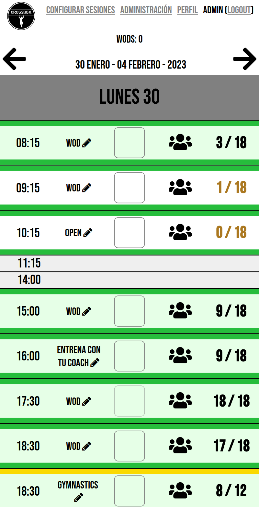{: .center loading=lazy width=30% }
  <figcaption>Landing page, here users can see and book sessions</figcaption>
</figure>

Payments are managed with [Stripe](https://stripe.com/), users are charged every month the amount of their plan and they receive tokens called "wods". They swap these "wods" per training sessions.

!!! info ""

    Everything is in Spanish as this app never was intended to have translations, all users wanted the app to be in Spanish.

## Local installation

You can read the readme in the [github page](https://github.com/oalfonso-o/crossbox).

## Usage
### Types of users
#### Admin User
Admins are Django admin users who can access everything, define the week session templates, the price of the sessions, etc. Manage everything, like a typical admin, nothing special.

#### Normal User (client)
This is what you have when you register as a new client.

### App usage by admin user
The main challenge of this application was to reduce the amount of time the admins spend creating the upcoming sessions. Let's see it in more detail.
#### App view
In order to facilitate the creation of sessions with the different conditions that a session can have, there are multiple models and views that are implemented to make this weekly process a bit more smooth and fast.
##### Configure sessions
The main idea here was to generate templates with all the sessions for a week and then being able to apply these templates to the upcoming weeks on demand, because with pandemic and other factors there was the need of changing the sessions from one week to the other.
###### Template
First we have to create a template from the Admin page, in the Week Template view. In the admin page we will see it empty and now we have to go to the view of the app to configure it.
###### Configure one session
At the top of the landing page we can see a button called "Configure Sessions", we click there and then we have our week view with a selector of week templates. We pick our template and then we are free to start configuring it.

<figure markdown>
  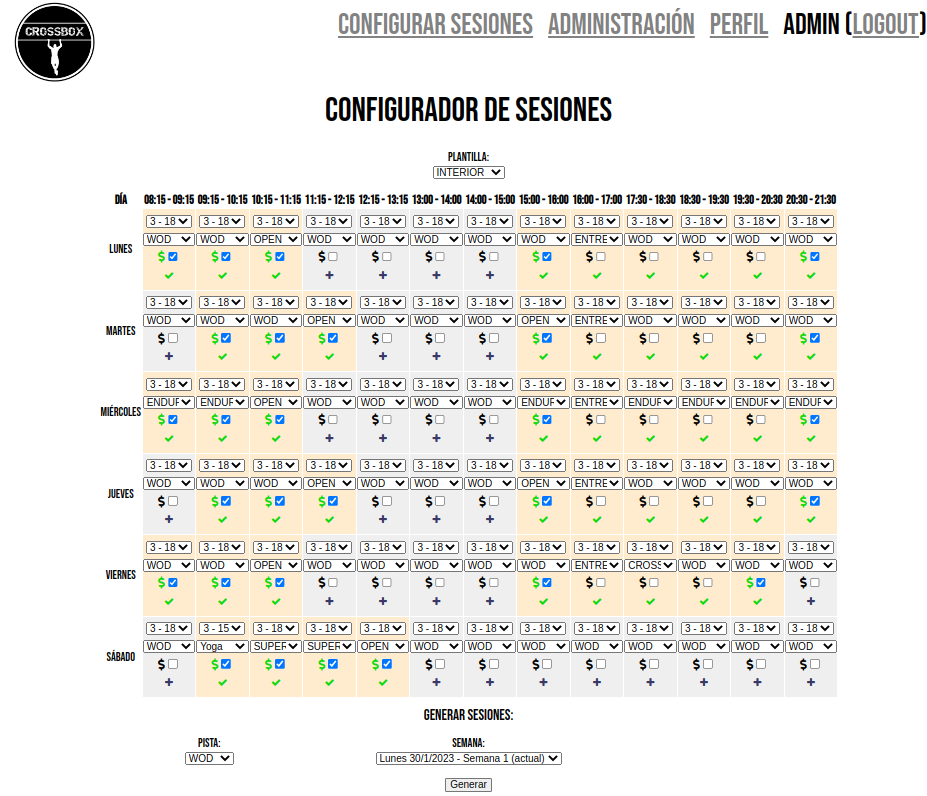{: .center loading=lazy width=30% }
  <figcaption>Configure Sessions view</figcaption>
</figure>

Here we can configure sessions by each day/hour that we have created in our Admin page. If you can't see any day/hour you need to go to the admin page and create the days/hours that the gym is going to offer sessions.

If we focus on one session we see this:
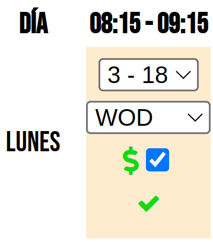{: .center loading=lazy width=20% }
A session has:

- Day: this can't be selected, the sessions are generated by the permutation of days/hours
- Hour: the same as Day
- Session capacity: The minimum and maximum amount of users registered for that session. Less than that number means that session is not going to be done, and once reached the limit nobody else can join. The upper limit doesn't need to be explained but the bottom limit is to avoid doing sessions for not enough people that doesn't generate enough profit
- Session type: It's where it says "WOD", sessions can have different types of trainings and that's informed to the users with this field
- Mornings Discount: it's that checkbox with a dollar emoji (:material-currency-usd:). This is used to flag those sessions that belong to the "morning users plan". They pay a bit less every month but they can't go to the afternoon sessions, only the ones in the morning which are less crowded
- Active: We can activate or deactivate those sessions that we want to create with this template. It's controlled with the little check (*:material-check:*) at the bottom. When active it passes to be  **green** and the cell changes it's color to blanchedalmond

To submit changes on that session you have to activate it, so if it's an already activated session you have to deactivate and reactivate it, and changes will be persisted on that template.

###### Generate sessions
Once you have your template with all the sessions that you want to apply to a week, you only need to pick the area where the session will be held, the WOD is the main and the OPEN is the secondary. Then select the week and click "Generate".
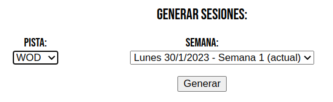{: .center loading=lazy width=50% }

##### Edit a session
Once sessions are created they appear in the landing page so the users can do their reservations.
If people book for a session they will spend one WOD (it's a credit, each class/session costs 1 wod), so sessions can't be just deleted, in that case a refund is needed but it has also the inconvenient that you need to notify the people about it. There are different ways to edit a session:

- Edit the type from the landing page: only admins will see a pencil next to the session type, clicking that you can select the next session type:
<figure markdown>
  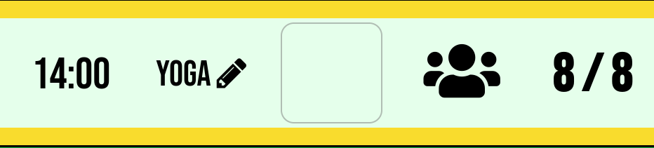{: .center loading=lazy width=30% }
  <figcaption>Users don't see that pencil</figcaption>
</figure>

- Regenerate the whole week: if you generate sessions for that week, all existing sessions of that week will be wiped first before generating the new ones. This has to be done only when you know it's safe to do it.
- Edit the session from the admin: in the admin page there's a CRUD for each model, so there's one for sessions. Search for it and edit it, but remember that maybe some users have spent 1 wod for that session with the previous details, if the session is going to be much more different is good to notify them, the app has no automatic notifications in place for these changes.
<figure markdown>
  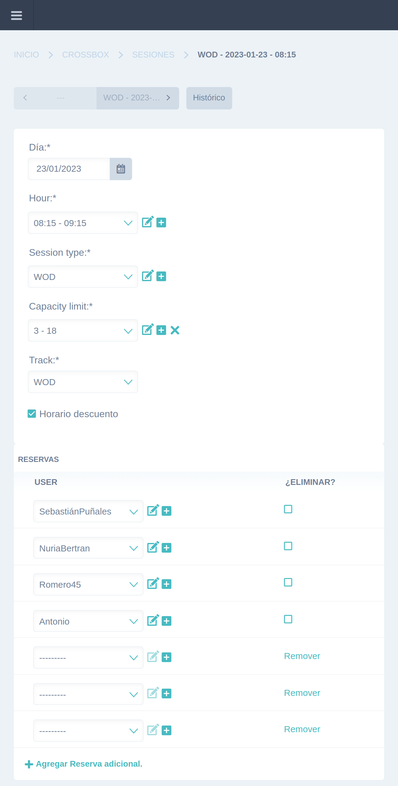{: .center loading=lazy width=30% }
  <figcaption>Here you can edit everything, even people who reserved for this session</figcaption>
</figure>

- Delete a session: from the list view in the admin you can "Delete" the Session in bulk or "Delete + refund" also in bulk:
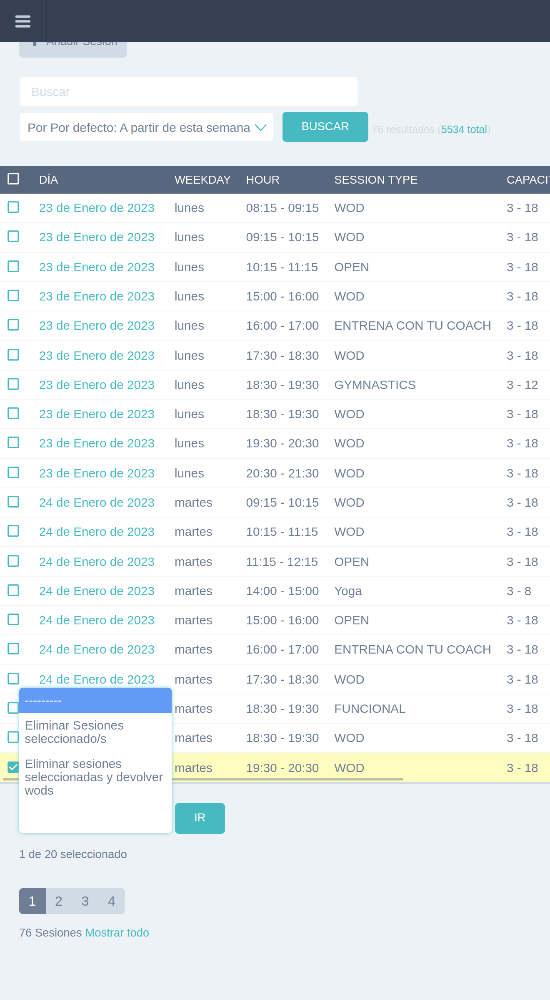{: .center loading=lazy width=50% }

#### Admin page overview
Django admin view:
<figure markdown>
  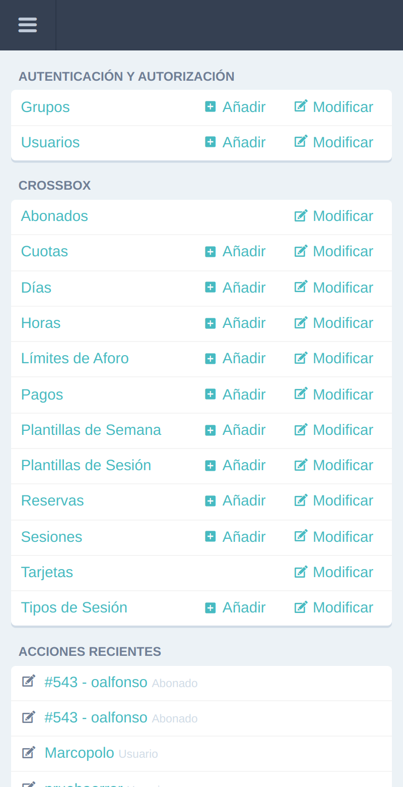{: .center loading=lazy width=30% }
  <figcaption>Admin view</figcaption>
</figure>

##### User
Django users, this is the vanilla user to handle authentication and authorization with a pre_save signal to manage Stripe integration.
[Code](https://github.com/oalfonso-o/crossbox/blob/master/crossbox/models/user.py)

##### Subscriber
One2One model to user, to add extra features.
[Code](https://github.com/oalfonso-o/crossbox/blob/master/crossbox/models/subscriber.py)

##### CapacityLimit
Model to handle the lower and upper limits of a Session.
[Code](https://github.com/oalfonso-o/crossbox/blob/master/crossbox/models/capacity_limit.py)

##### Day
Week days that your gym can generate sessions. Used by the Week Template, to suggest sessions to create.
[Code](https://github.com/oalfonso-o/crossbox/blob/master/crossbox/models/day.py)

##### Hour
Day hours, you can specify when they start and they always are of 1 hour. Used by the Week Template, to suggest sessions to create.
[Code](https://github.com/oalfonso-o/crossbox/blob/master/crossbox/models/hour.py)

##### Fee
These are the plans that the users can select, they have a price and an amount of wods to get for that price. The payment is monthly, processed with Stripe.
[Code](https://github.com/oalfonso-o/crossbox/blob/master/crossbox/models/fee.py)

##### SessionType
To specify the type of training that will be performed in that session.
[Code](https://github.com/oalfonso-o/crossbox/blob/master/crossbox/models/session_type.py)

##### Session
Users reserve sessions, which have an specific day and specific time.
[Code](https://github.com/oalfonso-o/crossbox/blob/master/crossbox/models/session.py)

##### SessionTemplate
It's the same as a session but without relation to a real day, it's only related to a WeekTemplate. It's used to recreate sessions across upcoming weeks.
[Code](https://github.com/oalfonso-o/crossbox/blob/master/crossbox/models/session_template.py)

##### WeekTemplate
Aggregation of multiple SessionTemplates in a week. Used to generate the whole sessions for a new week.
[Code](https://github.com/oalfonso-o/crossbox/blob/master/crossbox/models/week_template.py)

##### Reservation
Users spend 1 wod and create a reservation in an specific Session, this allows them to assist to that specific Session.
[Code](https://github.com/oalfonso-o/crossbox/blob/master/crossbox/models/reservation.py)

##### Card (Stripe)
Users in their profile can add their Card with Stripe. This card will be used to charge them the price of their Fee every month and provide them the amount of wods of their Fee plan.
[Code](https://github.com/oalfonso-o/crossbox/blob/master/crossbox/models/card.py)

!!! info
    Cards are never stored in the app, Stripe encrypts the card and is sent to their servers, they give back an ID related to that card and that's all that is stored in this app, nothing else. For more info check [Stripe.js reference](https://stripe.com/docs/js) and the [Stripe Python API Reference](https://stripe.com/docs/api?lang=python).

##### Payment
Every Stripe charge generates a Payment, is just a history.
[Code](https://github.com/oalfonso-o/crossbox/blob/master/crossbox/models/payment.py)

### User Usage
The idea was to keep the usage for the users as [simple](https://en.wikipedia.org/wiki/KISS_principle) as possible. So users register with a simple form, they add their payment method, they search for their desired day/hour and they click a simple checkbox to book their training session.

#### Login
A users/password login page:
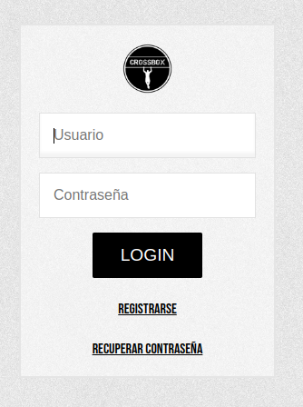{: .center loading=lazy width=30% }

##### Register
Registration form. Once the user is created an email is sent to an admin email. The user will be created disabled and the admin has to manually activate this user. This was decided to prevent reaching quota limits, sometimes there was a queue and people had to wait months to be able to join the gym.
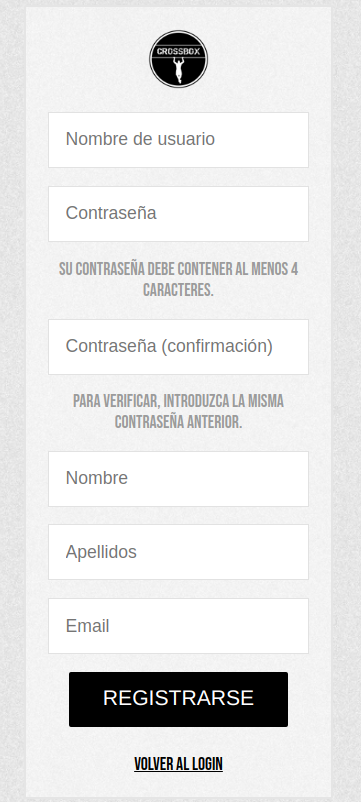{: .center loading=lazy width=30% }

##### Restore password
At the login page there's a feature to restore your password, the Django builtin.
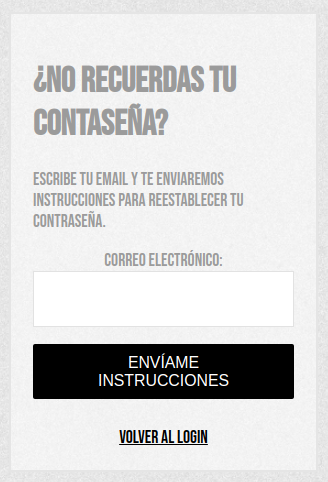{: .center loading=lazy width=30% }

##### Logout
At top of the landing page there's a button next to the user name to do logout.

#### Profile
Here is where users see their info and their payment method.
<figure markdown>
  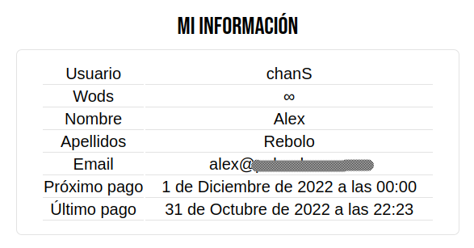{: .center loading=lazy width=50% }
  <figcaption>In this case this user has ∞ wods because it's fee is the "unlimited" one. Other users see a number of wods depending on their plan.</figcaption>
</figure>

##### Payment method
Here users add their card:
<figure markdown>
  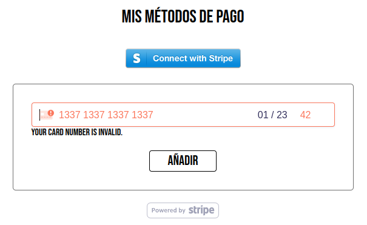{: .center loading=lazy width=50% }
  <figcaption>Spoiler: Fake card number</figcaption>
</figure>
And after adding it then they see it and can add more cards, but there will be always only one as default which will be used to process the payments:
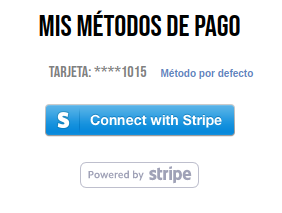{: .center loading=lazy width=30% }

!!! info
    Cards are never stored in the app, Stripe encrypts the card and is sent to their servers, they give back an ID related to that card and that's all that is stored in this app, nothing else. For more info check [Stripe.js reference](https://stripe.com/docs/js).

##### Fees
Users after registering a card can select a fee, and that's the price that will be charged and the amount of wods that will be purchased:
<figure markdown>
  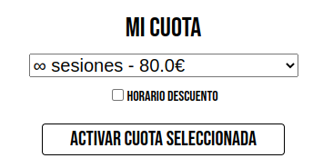{: .center loading=lazy width=30% }
  <figcaption>Here the fee selected is the unlimited but it can be changed</figcaption>
</figure>
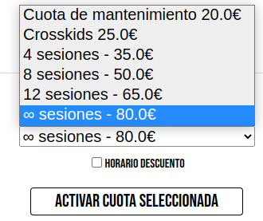{: .center loading=lazy width=30% }

#### Sessions
Once they have their user created, activated, with a valid card, with a selected fee and they have wods now they can do a reservation to a Session. In the main page they will see this:

<figure markdown>
  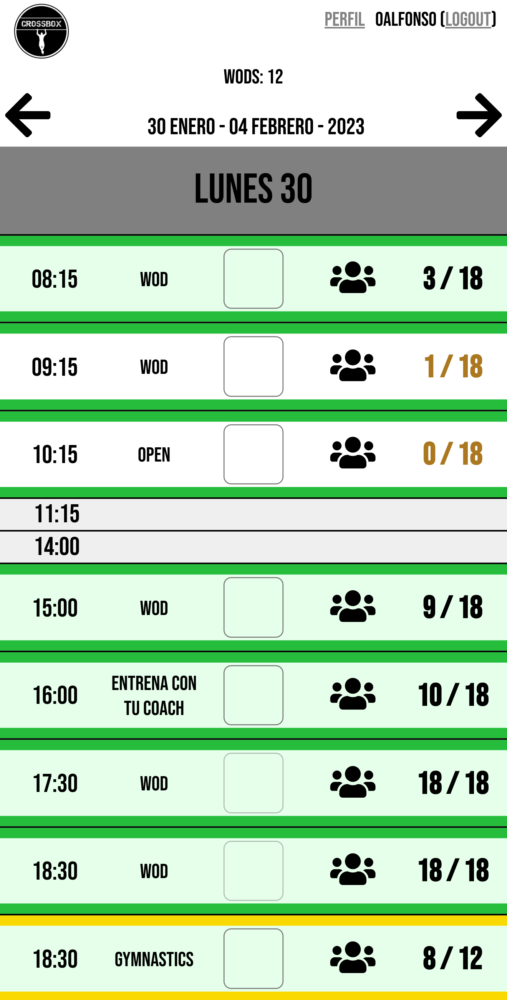{: .center loading=lazy width=30% }
  <figcaption>This user has 12 wods, so can do a max of 12 reservations</figcaption>
</figure>

!!! info
    Notice that wods will be provided only at the end of the month, if the user is new and needs wods at the moment they need to talk with an admin.

##### Create a reservation
To create a reservation the user needs to click the checkbox on any upcoming session that has an available slot. At that moment the user will spend one wod and the checkbox will appear in green:
<figure markdown>
  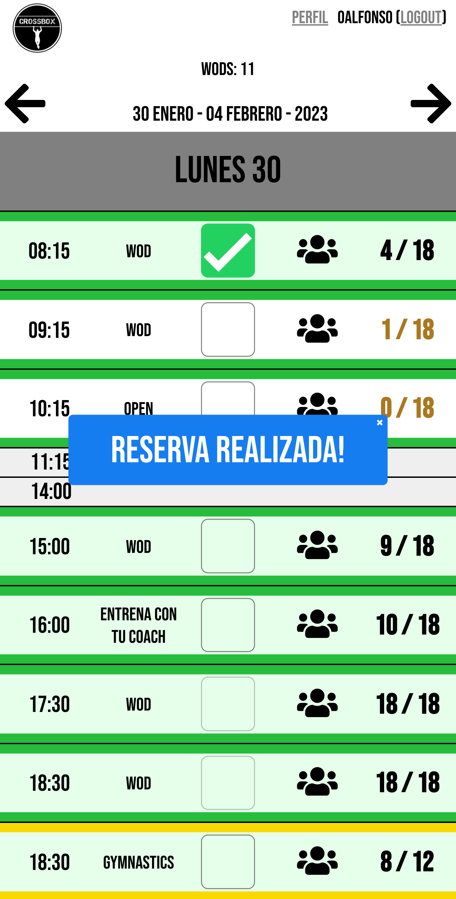{: .center loading=lazy width=30% }
  <figcaption>Now the user has 11 wods and a reservation: a WOD session for the 30th of January 2023 at 08:15</figcaption>
</figure>

!!! Disambiguation
    A *wod* can mean:

    - the app token used to do a reservation
    - the default type of Crossfit session

### Monthly payments (Stripe)
To prevent having to deal with manual payments every month (the gym obviously started with manual payments) the ideal scenario was to automate this system, so Stripe came to our lives.

How users can register they card is already explained in the previous section, so in this section there's only left mentioning how the system processes the payments.

Basically there's a [systemd](https://en.wikipedia.org/wiki/Systemd) service running some Python code that is constantly checking for the date being the last day of the current month at 22:00 (local server time, CET in this case), in other words: a Python cron. Once it happens then checks for all active users, with active subscription and sends a charge to Stripe, if it works then the amount of wods of their plan are added to their subscriber and an email is sent to notify. If there's an error (because the payment couldn't be processed) the email is sent too but notifying about the issue.

The code can be checked on [Github](https://github.com/oalfonso-o/crossbox/blob/master/crossbox/scheduler/run.py).
